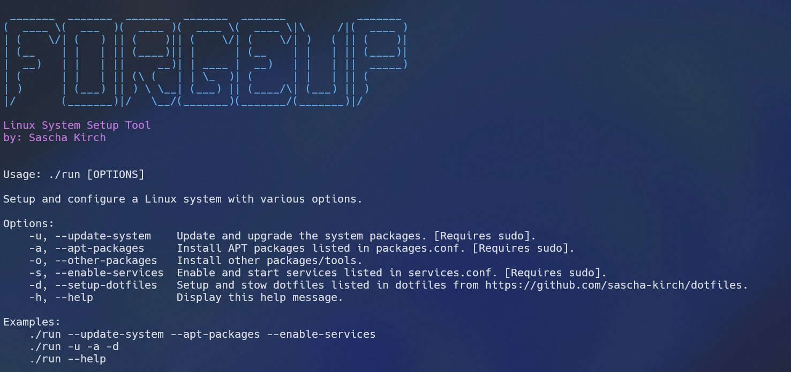

# linux-forgeup

Forge-Up is a lightweight setup and bootstrap tool for Debian/Ubuntu-based systems. It targets two common scenarios:

1. Fresh system provisioning (with sudo): install APT packages, enable services, apply dotfiles.
2. Constrained environments (no sudo): install user-local binaries directly from GitHub releases into `$HOME/.local/bin` and `$HOME/.local/packages`.

## Why

On many servers (CI runners, shared university hosts, corporate bastions) you lack sudo. Standard package managers become unusable. Forge-Up provides helpers to fetch and unpack release artifacts locally (e.g. `install_starship_prompt`, `install_eza`, `install_ripgrep`) so you still get modern tooling.

## Features

- APT batch install via `install_apt_packages` using [packages.conf](packages.conf) (sudo only).
- Local (no sudo) GitHub release installers:
  - Binaries: `install_gh_binary`
  - Packages with symlink: `install_gh_package`
  - Convenience wrappers: `install_starship_prompt`, `install_eza`, `install_fzf`, `install_ripgrep`, `install_lazygit`, `install_navi`, `install_nvim`, `install_dust`, `install_zoxide`, `install_lazydocker`
- Dotfiles cloning + stowing via `setup_dotfiles` and `stow_dotfiles` using [dotfiles.conf](dotfiles.conf).
- Service enabling via `enable_services` using [services.conf](services.conf).
- Logging helpers (`log_info`, `log_warning`, `log_error`, `log_config`).
- Tmux setup helpers (`install_tmux_plugin_manager`, `setup_tmux`).

## Quick Start (Full Provisioning)

```bash
git clone https://github.com/sascha-kirch/linux-forgeup.git
cd linux-forgeup
chmod +x run
./run -u -a -o -d
```



Flags:
- `-u` update system
- `-a` install APT packages
- `-o` install other (local) packages
- `-d` clone & stow dotfiles
- `-s` enable services (if any listed)
- `-h` help

Example minimal (only local user installs, no sudo):
```bash
./run -o
```
If you lack sudo, Forge-Up auto-disables APT and service steps.

## Using Individual Functions (No Sudo Workflow)

Instead of running the full script you can source `utils` in an interactive shell:

```bash
git clone https://github.com/sascha-kirch/linux-forgeup.git

cd linux-forgeup
. ./utils          # or: source utils

install_starship_prompt v1.23.0
install_eza
install_ripgrep 14.1.1
install_lazygit v0.55.1
```

Ensure `$HOME/.local/bin` precedes PATH:

```bash
export PATH="$HOME/.local/bin:$PATH"
```

Persist this by adding to `~/.profile` (before sourcing `~/.bashrc`):

```bash
# Ensure local bin tools are found early
export PATH="$HOME/.local/bin:$PATH"
```

## Selecting Versions

All convenience installers accept an optional version argument. Examples:

```bash
install_nvim v0.11.4
install_fzf v0.66.0
install_lazygit v0.55.1
```

If omitted, the internal default is used (see implementations in [utils](utils)).

## Dotfiles

To only handle dotfiles:

```bash
./run -d            # clones and stows those listed in dotfiles.conf
```

Or manually:

```bash
. ./utils
setup_dotfiles
stow_dotfiles tmux vim bash
```

> clones my [dotfiles](https://github.com/sascha-kirch/dotfiles) repository for setting up dotfiles

## Services

Add service names to [services.conf](services.conf):

```bash
SERVICES=(
  ssh
  cron
)
```

Then run:

```bash
./run -s
```

Requires sudo.

## Local Install Logic

- Binaries go to: `$HOME/.local/bin/<name>`
- Packages go to: `$HOME/.local/packages/<repo_subname>` then symlinked into `$HOME/.local/bin`
- Uses GitHub release tarballs: `install_gh_binary` (direct binary), `install_gh_package` (extract + symlink)
- Safe reinstallation via passing `true` internally (see wrappers)

## Logging

All actions produce time-stamped colored output:
- INFO / WARNING / ERROR / CONFIG

Example:

```
12:34:56 [INFO][FORGE-UP] Installed version 'v1.23.0' of repo 'starship/starship' ...
```

## Known Limitations / TODO

- Split `utils` into modular shell files.
- Add checksum verification for downloaded archives.
- Add uninstall functions for each tool.
- Improve version auto-discovery (currently manual defaults).
- only supports apt package manager and systemd for services.
- currently only GitHub releases as source for local installs.
- uses my own dotfiles repo; make this configurable.

## Troubleshooting

| Issue | Cause | Fix |
|-------|-------|-----|
| Tool not found after install | PATH not updated | Add `export PATH="$HOME/.local/bin:$PATH"` to .profile |
| APT steps skipped | No sudo group membership | Run only `-o` (local installs) or gain sudo |
| Neovim old version still used | `/usr/bin/nvim` shadowing | Remove system neovim (handled automatically in `install_nvim`) |
